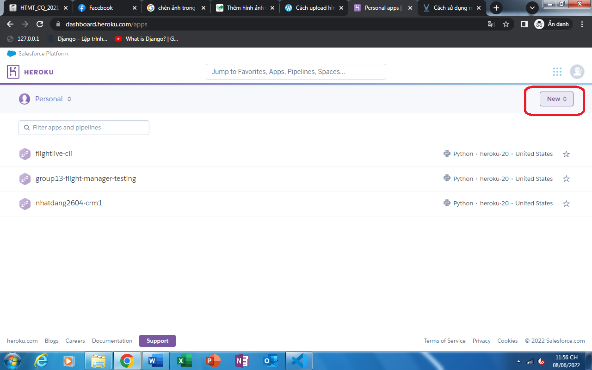
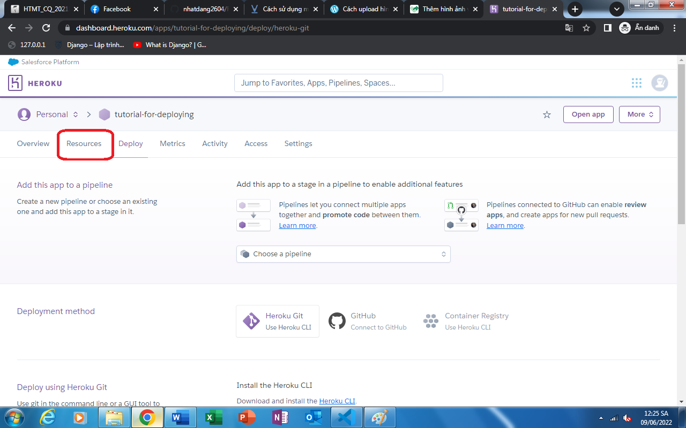
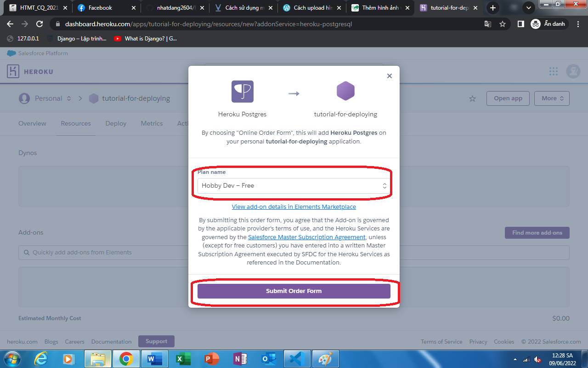
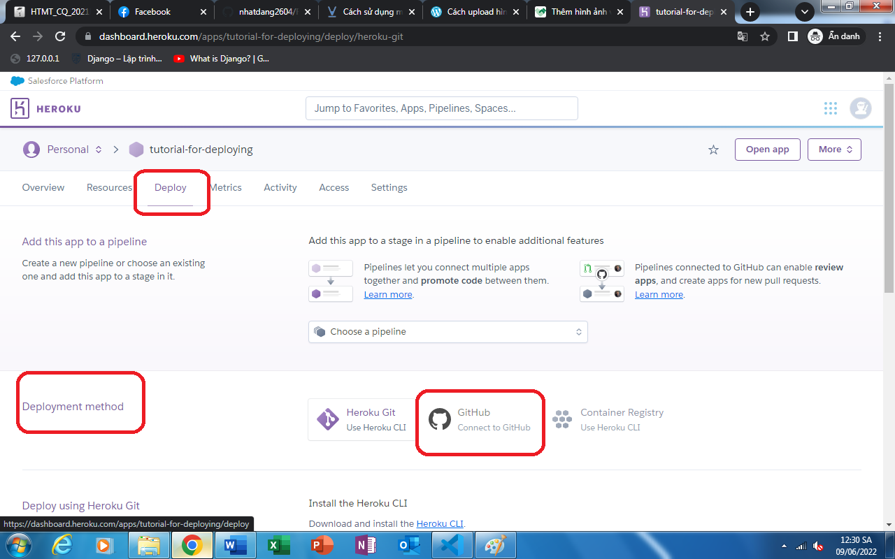
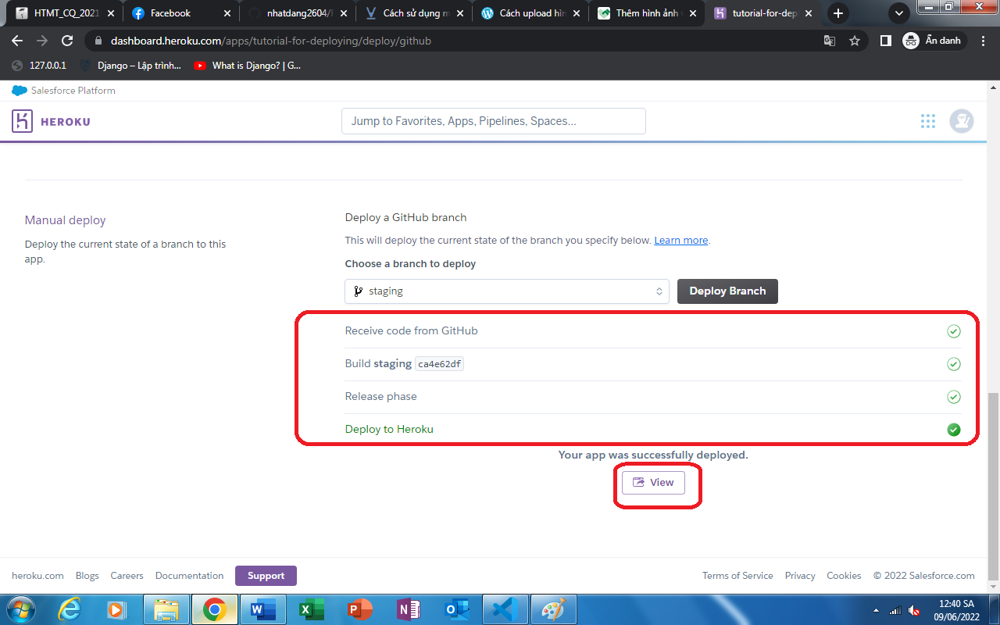
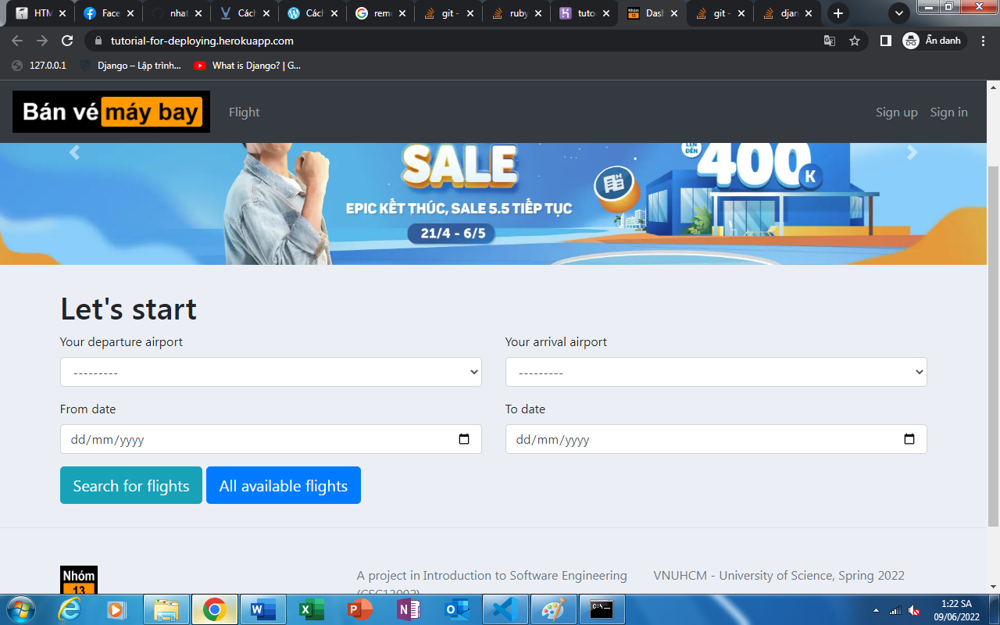

<p align="center">

<br/>
Đồ án Nhập môn Công nghệ phần mềm - Nhóm 13.
</p>

## Giới thiệu
### Nội dung
Đề tài của nhóm là một trang web chuyên dùng để tìm kiếm và đặt vé chuyến bay cho khách hàng, đồng thời cung cấp cho doanh nghiệp khả năng quản lý hệ thống bán vé chuyến bay

### Nhóm 13:
|SID|Name|GitHub handle|
|---|----|-------------|
|19120338|Trần Hoàng Quân|[@trhgquan](https://github.com/trhgquan)|
|19120469|Sử Nhật Đăng|[@nhatdang2604](https://github.com/nhatdang2604)|
|19120542|Trần Cẩm Khánh|[@flauwa](https://github.com/flauwa)|
|19120598|Nguyễn Thị Kim Ngân|[@ntkngan1185](https://github.com/ntkngan1185)|
|19120682|Lê Hoàng Trọng Tín|[@nuno314](https://github.com/nuno314)|

## Tham khảo
### Backend
- [Django documentation v4.0](https://docs.djangoproject.com/en/4.0/)
- [django_filter documentation (stable version)](https://django-filter.readthedocs.io/en/stable/)
### Frontend
- [Trang chủ của Traveloka](https://www.traveloka.com)

## Môi trường cài đặt
- Hệ điều hành: Windows 7/8/10
- Ngôn ngữ lập trình: Python 3.x
- Framework sử dụng: Django
- Phiên bản framework: Django 4.0.4
- Database: PostgreSQL

## Cài đặt
### Install required packages
```
pip install -r requirements.txt
```

### Database migration
```
cd FlightManager
python manage.py migrate
```

### Chạy server
Browse vào thư mục FlightManager,
```
python runserver.py runserver
```

### Hướng dẫn deploy
#### Yêu cầu
- Người deploy đã cài đặt Heroku CLI
- Người deploy phải có một tài khoản [GitHub](https://www.github.com)
- Người deploy phải có một tài khoản [Heroku](https://www.heroku.com/)
- Tài khoản github này phải có 1 repository đã được push mã nguồn từ branch _staging_ ở repo này

#### Hướng dẫn
##### Bước 1: Tạo app
- Truy cập vào [Heroku](https://www.heroku.com/) và đăng nhập vào tài khoản đã tạo sẵn
- Nhấn vào nút _new_ để tạo một app mới trên __Heroku__

    

- Chọn _Create new app_

    

- Đặt tên, chọn region cho app, sau đấy nhấn nút _Create_

    

- Ta được chuyển đến màn hình quản lý app

    

##### Bước 2: Tạo Heroku PostgreSQL để sử dụng PostgreSQL
- Trên màn hình quản lý app, chọn _Resource_

    

- Trên thanh tìm kiếm, hãy tìm keyword _Heroku Postgres_

    

- Chọn phiên bản _Hobby Dev - Free_ và nhấn __Submit Order Form__

    

##### Bước 3: Tiến hành deploy

- Trên navbar, chọn _Deploy_, kéo xuống phần __Deployment Method__ và chọn _Connect to GitHub_

    

- Đăng nhập vào tài khoản [GitHub](https://www.github.com) đã chứa repository có source code để deploy, sau khi thành công, tài khoản sẽ xuất hiện trên [Heroku](https://www.heroku.com/)

    

- Trên thanh tìm kiếm repository, tìm kiếm repository chứa source code để deploy, sau đấy nhấn _Connect_ vào kết quả repository

    

- Ở phần __Manual Deploy__, chọn branch có chứa source code để deploy của repository đã tìm kiếm được, sau đây nhấn _Deploy Branch_

    

- Chờ đến khi hiện ra kết quả deploy thành công, ta nhấn vào nút _View_ để mở app

    

- Lúc này, ta sẽ bị lỗi, vì ta chưa migrate database từ dbsqlite mặc định của Django với Heroku Postgresql, ta sẽ chuyển sang bước tiếp theo

    

##### Bước 4: Migrate database

- Mở __Command Prompt__ và sử dụng lệnh bên dưới để đăng nhập vào [Heroku](https://www.heroku.com/)
    ```
    heroku login
    ```

- Dùng câu lệnh bên dưới để kết nối Heroku remote repository đã tạo sẵn (do deploy thành công ở bước 3) trên Heroku với local repository.
    ```
    heroku git:remote -a app_name
    ```
với app_name chính là tên của app được tạo ở bước 1, trong trường hợp này là __tutorial-for-deploying__

- Cuối cùng, dùng câu lệnh bên dưới để migrate database trên remote repository
    ```
    heroku run python FlightManager/manage.py migrate
    ```

- Tới đây, ta đã có thể vào được app đã tạo mà không bị lỗi

    